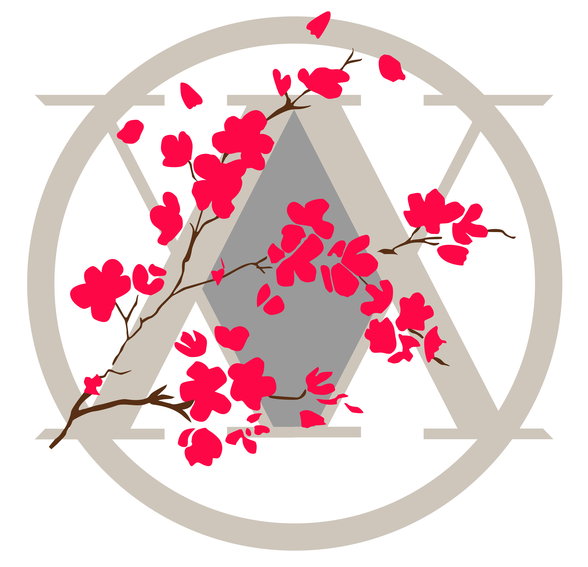

<h1 align="center">OVA Untainted Toolbox</h1>

<i>A curated resource vault for ongoing GameDevs and Artists!</i>

  

> ⚠️ **Note:** This is a hand–picked collection of tools, assets, tutorials, and tips gathered during our Game Dev Journey.  
> While it focuses on:
> – Unreal Engine
> – Blender
> – Substance Painter
> – SideFX Houdini
> – ZBrush  
>
> It also includes:
> – Drawing & Digital Painting  
> – Anatomy & 2D Tools  
> – Audio, Fonts, Level Design, Storytelling  
> – ...and more!  
>

---
## Socials  

[**LinkTree**](https://linktr.ee/ova.untainted)  – **Discord** – **Pinterest** 

---
## Game Development 

- [**Develop Games**](https://develop.games/) – Pirate Software’s dev motivation hub.
- [**Engines Database**](https://enginesdatabase.com/)–  Database of all available Game Engines

### Prototyping

- https://machinations.io/
- https://excalidraw.com/

### Game Jams

- [**Game jams on itch.io**](https://itch.io/jams) – Listing of itch.io game jams

### Unreal Engine

- [**William Faucher's Youtube Channel**](https://www.youtube.com/@WilliamFaucher) – Pretty cool Channel revolving around Unreal 5
- [**GameFromScratch**](https://gamefromscratch.com/) – GameDev Portal with News, Tutorials and More
- [**Blueprintue**](https://blueprintue.com/) – Share and find Blueprints
- [**Allar’s UE5 Style Guide**](https://github.com/Allar/ue5–style–guide/tree/v2) –  A pretty Solid Style Guide for Unreal Engine 5
- [**FAB Launcher – Limited Time Free**](https://www.fab.com/limited–time–free) – Free Assets and more , periodically free
- [**Awesome Unreal GitHub**](https://github.com/insthync/awesome–unreal) –  Awesome Github Collection
#### Blueprint Templates

- [**TP 2D Sidescroller**](https://github.com/CobraCodeDev/TP_2DSideScrollerBP) –  2D Side Scroller Blueprint Unreal Template

### Theory
#### Design and Concepts

- [**Gamedesigning.org**](https://www.gamedesigning.org/learn/game–design–document/) –  How to Write Your First Game Design Document
- [**Learning Essential Game Design Terms**](https://designoriented.net/wheel – Handy interactive tool for learning essential game design terms) –  Interactive tool for learning  game design terms
- [**Extra Credits Youtube Channel**](https://www.youtube.com/watch?v=zQvWMdWhFCc)  – Tons of useful Videos about Game Design and Concepts
- [**Game Maker's Toolkit**](https://www.youtube.com/channel/UCqJ–Xo29CKyLTjn6z2XwYAw) – deep dive into game design–, level design , and game production
- [**GMKT's Platformer Toolkit**](https://gmtk.itch.io/platformer–toolkit)– Interactive Game Made Game Maker Toolkit about Game Design
- [**Pattern Language for Game Design**](https://patternlanguageforgamedesign.com/) – Interactive [**Pattern Library**](https://patternlanguageforgamedesign.com/PatternLibraryApp/PatternLibrary/) and [**Games Reference**](https://patternlanguageforgamedesign.com/PatternLibraryApp/GamesReference/) where you can share patterns with developers throughout the world.
- [**The Evolution of Trust**](https://ncase.me/trust/) – An interactive walkthrough of some game theory. 
- [**Game Developer Articles**](https://www.gamedeveloper.com/) – TechInfos about Game Development

#### Level Design

- [**Level Design and How To Get Into It**](https://80.lv/articles/level–design–tips–tricks–and–how–to–get–into–it/)  – An introduction to level design
- [**Level Design Book**](https://book.leveldesignbook.com/introduction) –  Level Design Book from A–Z

#### UI/UX

- [**WE CAN FIX IT IN UI**](http://www.wecanfixitinui.com/) – Gigantic list of UI/UX resources!
- [**Game UI Database**](https://www.gameuidatabase.com/index.php) – A  Repo of UI designs from many different games as reference.
- [**Laws of UX**](https://lawsofux.com/en/) – Best practices of UX design.

### Research

- [**Game Docs.Org**](https://gamedocs.org/category/design–document/) – A collection of design documents from completed games 
- [**DestinyUI/UX**](http://www.cand.land/destiny) – A collection of UI/UX documentation from Destiny 
- [**Robocast Youtube Channel**](https://www.youtube.com/@robokast) – Comprehensive VIdeos of  certain Games have failed
- [**Game AI for Beginners**](https://learn.saylor.org/course/index.php?categoryid=9) – The Total Beginner's Guide to Game AI
- [**Papers Please Devlog**](https://fguillen.github.io/PapersPleaseDevlogScrap/) – Posts from the development of Papers Please.
- [**Wicked Wiz Youtube**](https://www.youtube.com/@WickedWiz) – Asking the Question on what went wrong on the Game

### Marketing

- [**BreakingTheWheel**](https://www.breakingthewheel.com/getting–started–breaking–wheel/) – Huge Resource hot to market your Game

### Math for Game Dev

###  Video Playlists
- [**Coding Math**](https://www.youtube.com/playlist?list=PL7wAPgl1JVvUEb0dIygHzO4698tmcwLk9) – Playlist by [**Coding Math**](https://www.youtube.com/@codingmath)
- [**Math for Game Devs**](https://www.youtube.com/playlist?list=PLImQaTpSAdsArRFFj8bIfqMk2X7Vlf3XF)
- [**Pikuma Channel**](https://www.youtube.com/@pikuma)

---

## 3D Tools & Resources

### Jack of All Trades

- [**ArtStation Learning**](https://www.artstation.com/learning) – Free Tutorials for multiple Topics!
- [**Kenney 3D Assets**](https://kenney.nl/assets) – Multiple Models, 2D, 3D , Ui Audio, Textures 
- [**TheVGResource**](https://www.vg–resource.com/) – A Huge Video Game Resource Trove

### Tools
- [**Itch.io**](https://itch.io/tools) – Indie tools and assets.
- [**Goxel**](https://goxel.xyz/) – 3D voxel editor Goxel.
- [**Blockbench**](https://www.blockbench.net/) – Voxel Software

### Animation and MoCap

- [**Mixamo**](https://www.mixamo.com/) – Free character rigging + animations.
#### Models
- [**BlenderKit (Free filter)**](https://www.blenderkit.com/asset–gallery?query=order:–score+availability:free) – Models, Textures and Shaders for Blender
- [**PolyHaven**](https://polyhaven.com/) – CC0 Public Assets ( Models, Textures etc.)
- [**Quaternius**](https://quaternius.com/) – Animations , Assets , Models etc.
- [**TheBaseMesh**](https://thebasemesh.com) – 100% Free. CC0 License. Bases Meshes
- [**Kay Lousberg Assets**](https://kaylousberg.com/game–assets) – Stylized Models Asset Bundles
- [**PolyPizza**](https://poly.pizza/) – 3D Low Poly Assets

#### Textures
- [**AmbientCG**](https://ambientcg.com/) –  Free 3D Assets for Everyone and Everything.
- [**CC0 Textures**](https://cc0–textures.com/) – A lot of CC0 Textures
- [**3DTextures.me**](https://3dtextures.me/) – Free PBR textures and Stylized textures with Color.
- [**CGBookcase**](https://cgbookcase.com/) – Free Photorealistic  Textures
- [**PolyHaven**](https://polyhaven.com/) – CC0 Public Assets ( Models, Textures etc.)
- [**ShareTextures**](https://www.sharetextures.com/) – CC0 Textures and 3D Models
- [**Plaintextures**](https://www.plaintextures.com/) – Collection of (PBR)Textures, Pictures, Patterns and Brushes 
- [**Textures.com**](https://www.textures.com/free) – Tons of Texture Assets 
- [**PublicDomainTextures**](https://publicdomaintextures.com/) – Public Domain Texture Collection
#### Icons
- [**Game–icons.net**](https://game–icons.net/) – Over 4.000 Free Game Icons

#### Animation
- [**Imphenzia Animation Tutorials**](https://www.youtube.com/watch?v=XkiWBSSuxLw)
- [**Rigging for impatient people**](https://www.youtube.com/watch?v=DDeB4tDVCGY) 
- [How to Animate Your 3D Characters Fast](https://www.youtube.com/watch?v=sTOgDe3EmQ0) – CG BOOST ANIMATION BLENDER

### Rest
– [**HumbleBundle Software Deals**](https://www.humblebundle.com/software) – Watchout for Asset / Course Deals
– [**ArtStation Marketplace**](https://www.artstation.com/marketplace/) – Free Courses !
– [**FlippedNormals**](https://flippednormals.com/) – Shop with alot of Resources
– [**OpenGameArt**](https://opengameart.org/) -  

---

## 2D Tools & Resources

### Tools

- [**Aesprite**](https://www.aseprite.org/) – Sprite Editor and Pixel Art Tool
- [**Pixel Composer**](https://github.com/Ttanasart–pt/Pixel–Composer) – Powerful node–based VFX editor for pixel art
- [**SpriteMancer**](https://spritemancer.com/) – The ultimate spire animation Software
- [**DitherBoy**](https://studioaaa.com/product/dither–boy/) – Dithering Software 
- [**Marmoset Hexels**](https://store.steampowered.com/app/428340/Marmoset_Hexels_3/) – Grid based Drawing Tool
- [**TexturePacker**](https://www.codeandweb.com/texturepacker)– Create sprite sheets and optimize your game graphics.
- [**SpriteFuison**](https://www.spritefusion.com/editor) – Free Tool Sprite Maker
- [**Level Designer Toolkit**](https://deepnight.net/tools/ldtk–2d–level–editor/) – 2D level editor from the director of Dead Cells
- [**OGMOEditor**](https://ogmo–editor–3.github.io/#) – open source, project oriented level editor

- [**Tiled**](https://www.mapeditor.org/) – A free and open source map editor

### Resources

- [**LoSpec**](https://lospec.com/) – A Pixel Art gold mine (Job Board, Palette Database, Tutorials, Resources, and more).
- [**Saint11 Pixelart Collection**](https://saint11.art/blog/pixel–art–tutorials/ –– Saint 11 Pixel Art bundles) –  A Collection of References and more by Saint11
- [**Open Game Art**](https://lpc.opengameart.org/) – Tons of Pixelart Resources    
- [**Grid Paper**](https://gridpaper–maps.tumblr.com/) – A repository of maps and top–down views of levels.
### Fonts

- [**League of Moveable Type**](https://www.theleagueofmoveabletype.com/) – open source font foundry
- [**Font Library**](https://fontlibrary.org/) –  Fonts Fonts Fonts

### Animation

- [**Principle of Animation**](https://www.youtube.com/watch?v=haa7n3UGyDc&list=PL-bOh8btec4CXd2ya1NmSKpi92U_l6ZJd) – 12 Principle of Animation

---

## Inspiration

- [**Wikimedia Commons**](https://commons.wikimedia.org/wiki/Main_Page)  –
- [**CharacterDesignReferences**](https://characterdesignreferences.com/) –
- [**SetteiDreams**](https://setteidreams.net/) – The largest archive of animation production materials
- [**MapCrunch**](https://www.mapcrunch.com/) – Jump to random Places in the Real World

### Stylized and Video Games

- [**Nikke Visualizer**](https://nikke–db.pages.dev/visualiser ) – Nikke Webview
- [**TheVGResource**](https://www.vg–resource.com/) – A Huge Video Game Resource Trove

### Effects:

- [**Sakugabooru**](https://www.sakugabooru.com/) – Image Board for all kind of Effects from Anime and more 
- [**SakugaVideos**](https://sakuga.video) –  Show Random Effects from Anime Clips 

### Artwork

- https://public.work/
- https://index–of.eu/Drawings/
- https://gallerix.org/
- https://www.wikiart.org/en/artists–by–genre

### Artists

- https://www.artstation.com/bli
- https://www.instagram.com/zleepy.gal/?hl=en
- https://www.artstation.com/aki–yehuo

---

## Audio

###  Sound FX / Music
- [**Kenney Audio Assets**](https://kenney.nl/assets/category:Audio?sort=update) Kenney Audi Assets 
- [**Zapsplat**](https://www.zapsplat.com/) – Over 150,000 stunning sound effects (SFX)
- [**FreeSound.org**](https://freesound.org/) – Find any sound you like
- [**Unminus**](https://www.unminus.com/) – Free Premium Music
- [**GameSounds.xyz**](https://gamesounds.xyz/) – Game Sounds

### Audio Resources

- [**Game Audio Learning Resources**](https://docs.google.com/spreadsheets/d/1fcuhGEesLC_PWCwY3dIwLgF774sKswOwIcZECWiH7Xo/edit#gid=0)  mega list of game audio learning resources!
- [**The Sound Effects Bible**](https://postproduciendoenlaeav.files.wordpress.com/2017/09/the–sound–effects–bible–ric–viers.pdf) 🟪 – A book on everything sound effects. (Fooley)

### Editors & Tools

- [**Audacity**](http://audacity.sourceforge.net/) – Audio Tools for Cutting 
- [**sfxr.me**](https://sfxr.me/) – Web SFX generator
- https://sfbgames.itch.io/chiptone

---

## Painting & Drawing

- [**Solo Artist Curriculum**](https://www.soloartcurriculum.com/) – A curriculum built for the self-taught artist
- [**Lines and Edges**](https://bryan–sturm.github.io/articles/lines–and–edges/) – A neat style guide for using edges and lines effectively
- [**Art Socials Resources**](https://www.notion.so/woolblossom/Art–Industry–Resources–86e6733162f24c26829aa65961f461e3) – Crazy Huge Collection of Art Resources
- [**Chaotics Crawling**](https://www.chaoticscrawling.com/learn)

### Resources

- [**Drawabox**](https://drawabox.com/) –  Starting Point into Drawing in Perspective
- [**Marc Brunet (YouTube)**](https://www.youtube.com/user/bluefley00) – Ex–Blizzard Digital Artist, with lots of Tutorials
- [**Ctrl+Paint**](https://www.ctrlpaint.com/) – Concept Art Videos
- [**VIShopper**](https://www.vishopper.com/) –  Tons of Reference Images

### Anatomy & Poses

- [**ReferenceAngle**](http://referenceangle.com/) – Dynamic References of Angles (with emotions etc.)
- [**Line of Action**](https://line–of–action.com/) – A lot of References from Basic Shapes to Faces and Expression
- [**QuickPoses**](https://quickposes.com/en) – A cool Tool to get some Random Poses to learn from
- [**Posemaniacs**](https://www.posemaniacs.com/) – 3D Anatomy and Poses 
- [**SketchDaily Ref Tool**](https://www.sketchdaily.net/) Daily Challenges of Sketching
- [**How to Draw the Head**](https://www.youtube.com/watch?v=2T7cDY7YDsg) – How to Draw head

### E-Books

- [**Figure Drawing by Loomis**](https://archive.org/details/loomis_FIGURE_draw)
- [**Drawing the HEad by Loomis**](https://ia801403.us.archive.org/2/items/andrew–loomis–drawing–the–head–hands/andrew–loomis–drawing–the–head–hands.pdf)

---

*Made with passion by OVA Untainted 💀*